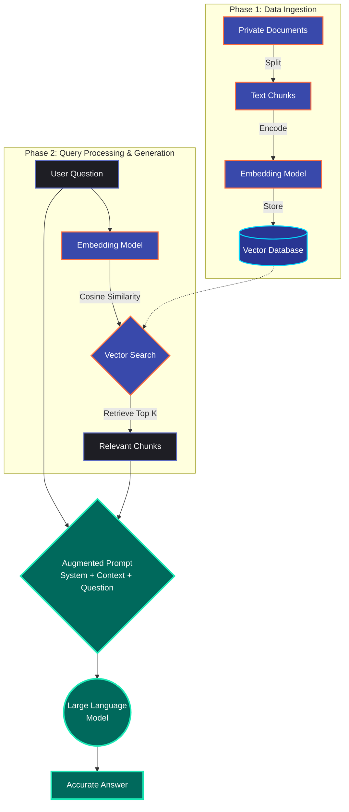

# Understanding Retrieval-Augmented Generation (RAG)

## What is RAG?

**Retrieval-Augmented Generation (RAG)** is an AI framework that improves the quality of Large Language Model (LLM) generated responses by grounding the model on external sources of knowledge.  

Think of an LLM as a very smart student taking an open-book exam. Without RAG, the student is forced to take the exam from memory (the data they were trained on, which has a specific cut-off date and lacks your private data). **RAG gives the student access to the actual textbook (your precise data) while they are answering the questions.**

## The Problem RAG Solves

Standard Large Language Models have a few inherent limitations that RAG directly solves:

1. **Hallucinations:** LLMs sometimes make things up with high confidence when they don't know the answer.
2. **Knowledge Cut-offs:** Models are frozen in time based on when they were trained. They don't know about current events.
3. **Lack of Private Data:** An LLM doesn't inherently know your company's proprietary documents, personal notes, or proprietary databases.

By fetching the exact, relevant facts *before* generating a response, RAG forces the LLM to base its answer on accurate, up-to-date, and private data.

---

## How Does RAG Work?

At its core, a RAG system operates in two distinct phases: **Data Ingestion** (preparing the knowledge base) and **Retrieval & Generation** (answering the user's question).

### 1. The Ingestion Phase (Building the Library)

Before you can ask a question, you have to build the database for the system to search through.

* **Extraction:** Documents (PDFs, Word docs, Notion pages) are read and converted to text.
* **Chunking:** The text is split into smaller, manageable pieces (e.g., 500 words per chunk). This is necessary because LLMs have context limits, and we only want to retrieve the highly relevant piece, not the whole 500-page book.
* **Embedding Model:** A specialized AI converts each text chunk into an **embedding** (a long array of numbers representing the *meaning* of the text in multidimensional space).
* **Vector Database:** These numbers (vectors) are stored in a specialized database, like Pinecone, Weaviate, or ChromaDB.

### 2. The Retrieval Phase (Finding the Needle)

* **Question Embedding:** When a user asks a question, the exact same Embedding Model turns the question into a vector.
* **Similarity Search:** The Vector Database rapidly searches for vectors (text chunks) that are mathematically closest to the question's vector. Concepts that are similar are grouped closer together in vector space.
* **Context Gathering:** The database returns the top most relevant chunks.

### 3. The Generation Phase (Synthesizing the Answer)

* **Augmented Prompting:** The RAG system builds a prompt that essentially says: *"Using only the following facts: [Retrieved Chunks], answer the user's question: [Original Question]."*
* **Final Output:** The LLM reads the constraints, understands the facts, and formulates a coherent, human-readable response based entirely on the provided context.

---

## How to Build Your Own RAG Pipeline

Building a RAG application is highly accessible right now thanks to great orchestration libraries. Here is a standard tech stack to get you started:

### Tech Stack Breakdown

* **Orchestration Framework:** [LangChain](https://www.langchain.com/) or [LlamaIndex](https://www.llamaindex.ai/) (These handle the plumbing between the steps).
* **Embedding Model:** OpenAI `text-embedding-3-small` or HuggingFace `BGE/MiniLM` (for local, free embeddings).
* **Vector Database:** [Chroma](https://www.trychroma.com/) (great for local dev/testing), [Pinecone](https://pinecone.io/) (for cloud scaling), or [pgvector](https://github.com/pgvector/pgvector).
* **Large Language Model (LLM):** OpenAI (GPT-4o), Anthropic (Claude 3.5), or local models (Llama 3 via Ollama).

### High-Level Blueprint (Python)

If you were using **LangChain**, the code to build this boils down to:

1. **Load data:** `PyPDFLoader("my_doc.pdf").load()`
2. **Split text:** `RecursiveCharacterTextSplitter(chunk_size=1000).split_documents(docs)`
3. **Create Vector DB:** `Chroma.from_documents(chunks, OpenAIEmbeddings())`
4. **Create the Chain:** Connect the retriever to a `ChatOpenAI` model via a `create_retrieval_chain`.
5. **Invoke:** `chain.invoke({"input": "What is the capital of France?"})`

---

## Things to Keep in Mind (Best Practices & Pitfalls)

RAG is easy to prototype but notoriously hard to push to high-accuracy production. Keep these things in mind:

### 1. Garbage In, Garbage Out

If your source documents are badly formatted, contain conflicting information, or are poorly parsed (especially complex tables in PDFs), the LLM will struggle to give good answers.

### 2. Chunking Strategy Matters

If your chunks are too small, they might lose context. If they are too large, they might contain too much noise, confusing the model and wasting tokens. You often need to experiment with chunk sizes and overlap.

### 3. The "Lost in the Middle" Phenomenon

LLMs tend to pay more attention to the beginning and end of their context windows. If you cram too many retrieved chunks into the prompt, the model might completely ignore a crucial fact located in the middle chunks.

### 4. Advanced RAG Techniques

Standard RAG isn't always enough. You may eventually need to explore:

* **Hybrid Search:** Combining vector similarity search with old-school keyword search (BM25) to catch exact names or IDs.
* **Re-ranking:** Retrieving 20 chunks, then using a lightweight model (like Cohere ReRank) to score and sort them, passing only the top 5 to the heavy LLM.
* **Query Expansion:** Using a smaller model to rewrite the user's query with synonyms before searching the database to increase retrieval rates.
* **Parent-Child Retrieval:** Retrieving small, highly specific chunks of text, but sending the *entire surrounding page or document* (the parent layer) to the LLM to give it full context.
